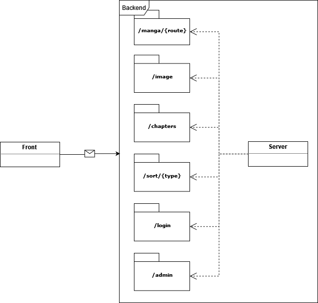

# Internal API usage

This API was developped for the project using Node.js as the backend. A simplified diagram of the API is presented below.

### Overview

In order for the client to recieve data, an internal api was put into place. The possible routes are as follows :

|               Routes               	|             Parameters            	|                                                                                  Return                                                                                  	|      Error Code      	|                        Description                        	|                         Note                        	|
|:----------------------------------:	|:---------------------------------:	|:------------------------------------------------------------------------------------------------------------------------------------------------------------------------:	|:--------------------:	|:---------------------------------------------------------:	|:---------------------------------------------------:	|
|          IP/manga/explore          	|                None               	|                                                              [ {name, tags, summary, latest, status}, ... ]                                                              	|                      	| Information about 5 manga to place in the explore section 	|                                                     	|
|           IP/manga/latest          	|                None               	|                                                                       [ {name, number, date}, ... ]                                                                      	|                      	|             List the eighth most recent series            	|   number is of the form {oneshot \| Chapitre XXX}   	|
|         IP/manga/info?id=n         	| id : int id of the manga to fetch 	| { manga_info: {name, note, summary, year, status, alt_name, type, magazine},  tags: {XXX, ... }, authors : { {name, surname}, ... }, chapters: { {name, number}, ... } } 	| 403-96bac4 Forbidden 	|             List all of a manga's information             	|   number is of the form {oneshot \| Chapitre XXX}   	|
| IP/sort/{alphabet \| note \| team} 	|                None               	|                                                      [ name, ... ] \| [ {name, note}, ... ] \| [ {name, team}, ... ]                                                     	|                      	|           Sort manga with respect to a criterion          	| All sort are in ascendant order (A -> Z and 5 -> 0) 	|

### API states in-depth explanations

Codes are constructed with the [error-type]-[SHA-256 of endpoint] [explanation] format and are based on the HTTP states.
They are :

- Explore [6f2811]:
    * Error 404-6f2811 Not found : Mangas information for the slide show were not found.

    * Deprecated : 
        - Error 401-6f2811 Unauthorized : Based on when the route had an id parameter and that the client request a manga in a private state.

- Latest [5e1e2b]:
    * Error 404-5e1e2b Not Found : Could not get the list of the eigth latest chapters.

- Information [96bac4]:
    * Error 401-96bac4 Unauthorized : The client hasn't the permission to view the information of this manga.

    * Error 404-96bac4 Not Found : The request manga's informations does not exist.

- General [103a52]:
    * Information 102-103a52 Processing : Used in the check of a parameter type. Indicates that the test was passed.

    * Success 201-103a52 Created : Used for acknowledging the request after having checked the parameter type.

    * Error 400-103a52 Bad Request : the request parameter is incorrectly used

    * Easter egg ;)

    Type checking is in this order :
    - Easter Egg
    - isNaN
    - isOverflow
    - isVisible

