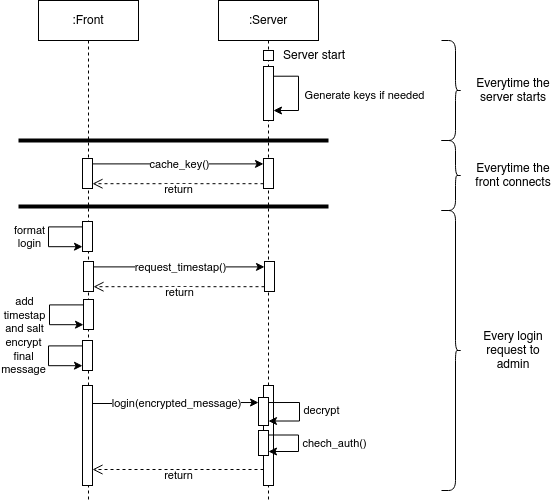

# Overview

This file describes the encryption scheme used for the administration part.
**it should be noted** that effort should be put to rewrite this using TLS
which is standard and - surely - safer.

# Design

This algorithm was designed using RSA in mind, however any crypto-algorithm
that use a public/private key pair should be able to replace RSA.

The sequence diagram of the algorithm is as follows : 

# Implementation

To see the implementation, please see the [Server side](../../server/routers/check_user.js) \
The Client side is in another repository with the admin front.